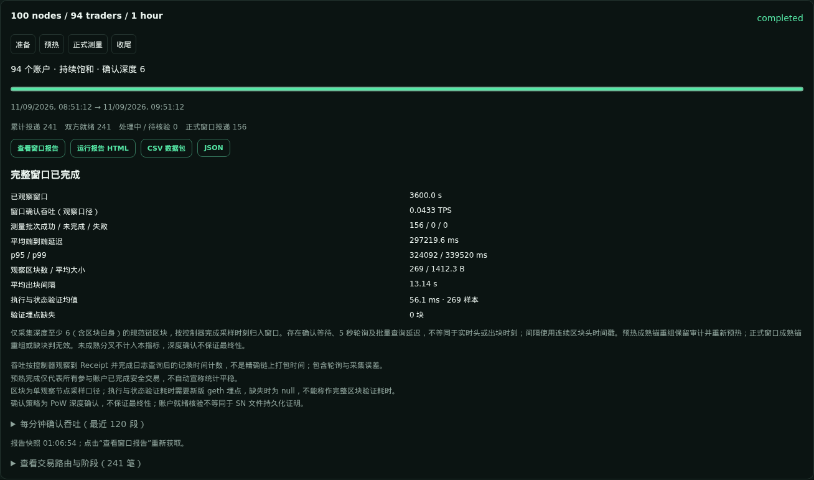
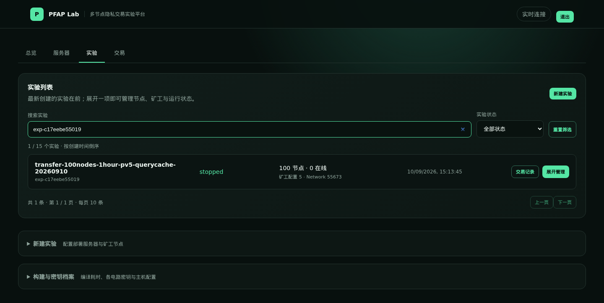
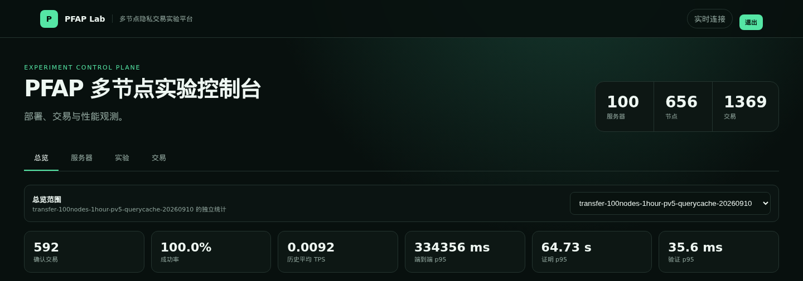

# PFAP · Anonymous payments, reproducible experiments

PFAP extends an Ethereum/geth fork with four zk-SNARK transaction types:
**CreateAccount, Mint, Redeem and Transfer**. PFAP Lab is the Web interface for
deploying multi-node networks, preparing accounts, running experiments and
exporting results.

**Start with Lab to reproduce experiments.** Use the command line for initial
build/setup, scripted repetition or low-level debugging—not as the default
way to coordinate anonymous transactions across nodes.

[Lab setup & user guide](lab/README.md) ·
[One-command 100-node workflow](lab/ONE_CLICK_EXPERIMENT.md) ·
[Advanced CLI / RPC reference](docs/COMMAND_LINE.md)

## Explore PFAP Lab

### Measure a complete run, not an aggregate dashboard

Prepare accounts, warm up participants, measure a fixed window, drain accepted
transactions and export the run. Reports include units, sample counts, metric
definitions and limitations; whole-experiment exports preserve separate runs.



This is the actual completed 100-node run from September 11, 2026: five miners,
one observer and 94 trading nodes; a 3,600-second measurement window with 156
formal submissions, all eventually confirmed. It is a baseline,
**not a maximum-throughput claim**. Containers share physical hosts. See the
[recorded result and limitations](lab/ONE_CLICK_EXPERIMENT.md).

### Manage deployments and node roles

Register local/SSH workers, label their physical hosts, select miners, inspect
deployment progress and manage each experiment independently. The experiment
list is searchable and paginated, with newest entries first.



The captured experiment is stopped after completion. No nodes were restarted
to produce these screenshots.

### Inspect the right scope

Select an experiment in the overview to inspect its history. Use the individual
run report for formal-window performance: **historical average TPS is not
measurement-window TPS**. Header counters cover saved inventory across
experiments, not just the selected 100-node run.



Screenshots were captured from the real Lab UI on September 12, 2026, without
substituting data. Operational events and credentials are outside the captured
regions. [Screenshot provenance](docs/images/lab/README.md).

## Reproduce an experiment with Lab

### 1. Build and start the controller

Use a Linux controller with Docker, Go 1.24, Git, Bash and `sha256sum`.
The compatibility builder compiles in an Ubuntu 22.04 Docker image and produces
an amd64 runtime for workers with glibc 2.35 or newer. Workers run it natively;
they do not need Docker or a compiler.

```bash
git clone https://github.com/percyc/PFAP.git
cd PFAP
# First installation for a NEW network: generate the shared proving keys.
./scripts/build-compatible-runtime.sh --generate-keys
./build.sh lab
./lab/run-lan.sh
```

Open `http://<controller-address>:8090` and log in using the password generated
in `lab/data/password`. This starts the controller, **not an experiment**.
Keep it on a trusted network; never commit credentials or expose the service
directly to the public Internet.

See [controller and worker provisioning](lab/README.md) for SSH access, runtime
compatibility, dependencies, firewall requirements and custom configuration.
For later rebuilds that must preserve existing keys, omit `--generate-keys`.
Do not run the first-install key-generation command against an existing network.

### 2. Configure workers and deploy

In **服务器 / Servers**, add workers individually or in batches, verify SSH
host-key fingerprints, check connections and set reachable P2P addresses.
Give containers on the same physical host the same host-group label.

In **实验 / Experiments**, create a separate experiment, choose placements and
miners, then deploy. Start with a four-node functional check: one dedicated
miner, one observer and two traders. For the documented 100-node layout, use
one process per server configuration, five miners on five host groups, one
local observer and 94 traders. Five miners is this experiment's configuration,
not a universal optimum.

### 3. Prepare accounts and run the measurement

In **交易 / Transactions**, select the experiment:

1. Ensure traders have public funds for fees and Mint; use preset Public
   transactions as needed. The Web preparation controls do not silently
   supply public funds.
2. Initialize uninitialized anonymous accounts with **CreateAccount** once,
   then **Mint** enough private balance for repeated Transfer transactions.
3. In **自动实验流程 / Automatic experiment**, choose non-miner traders and a
   dedicated observer; configure warmup, duration and confirmation depth,
   run the preparation check and explicitly start.
4. Monitor phase, actual submissions, confirmations and errors. Independent
   account pairs can run concurrently; **each account stays reserved until
   the transaction is confirmed and both sides are safe to use again**.
5. Wait for draining to finish. Export the individual run or whole experiment
   as HTML, JSON or CSV ZIP, then stop the network when no longer needed.

The Web workflow does not automatically stop all node processes when a run
finishes. The optional one-command workflow below does. Neither workflow
should replay unknown transactions or reset frozen anonymous state.

### 4. Optional: automate a fixed 100-node workflow

After deployment, the script can handle account preparation, warmup, a
one-hour window, draining, exports and verified node shutdown. It requires an
explicit experiment ID and mode; it does not create a deployment or choose the
latest experiment for you.

```bash
node lab/scripts/run-experiment.cjs --help
```

Follow the [one-command guide](lab/ONE_CLICK_EXPERIMENT.md) for read-only
preflight, fresh/prepared modes, progress and failure handling. This is an
automation companion to Lab, not a replacement for the Web setup workflow.

## Interpret results and preserve state

- Reports separate preparation, warmup, measurement and drain. Completing
  warmup qualifies participants; it does not prove statistical stationarity
  or maximum load.
- Confirmation throughput uses controller-observed receipts and includes
  polling/collection timing error. End-to-end latency includes proof generation
  and post-admission waiting.
- Block execution/state-validation timing excludes consensus-header validation,
  networking and database commit. Missing samples are not zero overhead.
- Node count is not physical-host count. Record resources, host groups,
  runtime version, keys and actual concurrency when comparing experiments.
- This is a research prototype for a single operator on a trusted network,
  not a production payment service. PoW confirmation depth is not finality.

All nodes on a network must use the same compatible runtime and proving keys.
Do not regenerate keys during an existing experiment. Preserve each node's
private-account journal; never publish private state or credentials in reports.

## Repository and technical references

| Path | Purpose |
| --- | --- |
| [`lab/`](lab/README.md) | Web controller, SSH deployment, scheduling and reports |
| [`go-ethereum/`](go-ethereum/) | geth fork with anonymous transactions and RPCs |
| [`libsnark-vnt/`](libsnark-vnt/) | CreateAccount / Mint / Redeem / Transfer circuits |
| [`scripts/`](scripts/) | Compatible builds and runtime packaging |
| [`test/pow/`](test/pow/README.md) | Low-level local lifecycle and transaction tests |
| [CLI / RPC reference](docs/COMMAND_LINE.md) | Circuit inputs, native builds and manual commands |

PFAP uses a shared depth-256 sparse Poseidon state tree for commitment
membership. Commitments themselves use SHA-256. Transfer carries the payer's
proof root and block anchor so the receiver can validate an accepted historical
canonical root rather than substituting the latest root.

For development, see [Lab's code map and handoff](lab/DEVELOPMENT_HANDOFF.md).
Dated validation notes are historical evidence, not live service status.

Related project: [BlockMaze](https://github.com/Agzs/BlockMaze).
